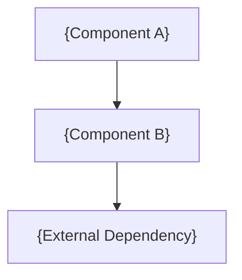

# {Component Name}

> Architecture document for {Component Name}. Maintained by {team/owner}.
<a name="REQ-TPL-08"></a>
**REQ-TPL-08** `advisory` `continuous` `soft` `all`
Required by §3.1 for every system component. Required before any significant change to this component - per §3.

> Required by [§3.1](../STANDARDS.md#31-component-architecture-template) for every system component. Required before any significant change to this component - per [§3.3](../STANDARDS.md#33-architecture-doc-backlog), no further changes to a component that lacks an architecture doc until that doc exists or an issue is filed to create it.

---

## Purpose

> [§3.1](../STANDARDS.md#31-component-architecture-template): one paragraph - what problem does this solve? What would break without it?

---

## Intended Goals (measurable)

<a name="REQ-TPL-09"></a>
**REQ-TPL-09** `gate` `design` `hard` `all` `per-item`
Architecture document goals are measurable with a specific metric, threshold, and measurement method.

> [§3.1](../STANDARDS.md#31-component-architecture-template): goals must be measurable. "Fast" is not a goal. "P95 latency under 200ms, measured by {metric}" is a goal.

- Goal: {metric, threshold, how measured}

---

## Current State vs. Intended State

> [§3.1](../STANDARDS.md#31-component-architecture-template): make gaps explicit. An architecture doc that only describes the target state hides current debt.

| Dimension   | Current | Target | Gap | Work Item ID |
|-------------|---------|--------|-----|-------------|
| Performance | | | | {§2.2 work item if gap exists} |
| Reliability | | | | |
| Security    | | | | |
| Observability | | | | |

<a name="REQ-TPL-12"></a>
**REQ-TPL-12** `gate` `design` `hard` `all` `per-item`
Each gap in the current vs target state table has a filed §2.2 work item ID.

> Each Gap cell that identifies a real deficiency must have a [§2.2](../STANDARDS.md#22-work-item-discipline) work item ID filed before or during the architecture doc review. A gap without a work item ID is an incomplete architecture doc.

---

## Architecture Diagram <!-- optional -->

> [§3.1](../STANDARDS.md#31-component-architecture-template): Mermaid diagram (preferred), or linked image. Must show component boundaries and communication paths. Mermaid renders natively on GitHub/GitLab and keeps the diagram source lintable and diffable.



---

## Data Flows

> [§3.1](../STANDARDS.md#31-component-architecture-template): trace the path of data through the component.

1. {actor} → {system} → {output}: {description}

---

## External Dependencies <!-- optional -->

<a name="REQ-TPL-11"></a>
**REQ-TPL-11** `gate` `design` `hard` `all` `per-item`
Every external dependency states what happens when it is unavailable: timeout, retry, and fallback behavior.

> [§3.1](../STANDARDS.md#31-component-architecture-template): every dependency must state what happens if it is unavailable. Unknown failure behavior is a reliability gap. See also [§5.4](../STANDARDS.md#54-restart-safety-and-resilience) for timeout and retry requirements.

| Dependency | Why needed | Behavior if unavailable | Timeout defined |
|-----------|-----------|------------------------|----------------|
| {Service/library} | | {degrade / fail / queue} | yes/no |

---

## Failure Modes

> [§3.1](../STANDARDS.md#31-component-architecture-template): per [§3.2](../STANDARDS.md#32-design-principles) Design for Failure - define behavior under failure at design time, not after the first outage.

| Failure | Impact | Mitigation | Recovery |
|---------|--------|------------|----------|
| | | | |

---

## Boundaries

> [§3.1](../STANDARDS.md#31-component-architecture-template): state explicitly what this component does NOT do. Boundaries that exist only in people's heads will be crossed.

What this component does NOT do:
-

---

## Design Principles Applied <!-- optional -->

> [§3.2](../STANDARDS.md#32-design-principles): document which design principles govern this component's design and any deliberate deviations.

| Principle | Applied how | Any deliberate deviation |
|-----------|------------|------------------------|
| SOLID | | |
| DRY | | |
| KISS | | |
| Fail Fast | | |
| Design for Failure | | |
| {Other relevant principles} | | |

---

## Team and Ownership Alignment <!-- optional -->

> [§3.4](../STANDARDS.md#34-conways-law-and-team-architecture-alignment): Conway's Law - the system structure mirrors the team structure. Verify alignment before finalizing component boundaries.

**Independent deployability:** Can this component be deployed without coordinating with another team? {yes / no - if no, describe the coupling}

**Independent testability:** Can this component be tested in isolation using test doubles? {yes / no - if no, describe the real coupling}

**Named owner:** {team or individual responsible for production health - per [§2.4](../STANDARDS.md#24-shared-ownership)}

---

## Architectural Decisions <!-- optional -->

<a name="REQ-TPL-64"></a>
**REQ-TPL-64** `advisory` `continuous` `soft` `all`
§4.2: every significant decision about this component must have an ADR. List them here for discoverability.

> [§4.2](../STANDARDS.md#42-adr-format): every significant decision about this component must have an ADR. List them here for discoverability.

| Decision | ADR | Status |
|---------|-----|--------|
| {What was decided} | [ADR-NNN](decisions/ADR-NNN-title.md) | Accepted |

## Risk Analysis <!-- optional -->

<a name="REQ-TPL-13"></a>
**REQ-TPL-13** `advisory` `continuous` `soft` `all`
If this component touches authentication, payments, data mutation, or external integrations, FMEA is required per §2.

> If this component touches authentication, payments, data mutation, or external integrations, FMEA is required per [§2.1 DESIGN](../STANDARDS.md#21-the-lifecycle). Link completed analyses here.

| Analysis | Path | Status | Last updated |
|----------|------|--------|-------------|
| FMEA | {link or N/A - state reason if N/A} | Complete / In progress / Not applicable | YYYY-MM-DD |
| FTA | {link or N/A} | Complete / In progress / Not applicable | YYYY-MM-DD |

---

## Security <!-- optional -->

<a name="REQ-TPL-14"></a>
**REQ-TPL-14** `advisory` `continuous` `soft` `all`
§5.10: required for any component that stores or processes sensitive data, handles authentication, or exposes external endpoints.

> [§5.10](../STANDARDS.md#510-minimum-security-baseline): required for any component that stores or processes sensitive data, handles authentication, or exposes external endpoints.

**Trust boundaries:** {where untrusted input enters this component}
**Data sensitivity classes:** {what data classes this component handles - public / internal / confidential / restricted}
**Credential scope:** {what permissions this component's credentials have}
**Redacted from logs:** {what is explicitly excluded from log output}
**Attack surface changes:** {what new surface this component introduces, and the documented mitigation}

---

## Future Implementor Notes <!-- optional -->

> [§3.1](../STANDARDS.md#31-component-architecture-template): what would have been useful to know at the start? What will the next person wish you had written down?

---

## Fault Tree Analysis and Reliability (always-on services with SLOs) <!-- optional -->

> [§3.1](../STANDARDS.md#31-component-architecture-template): required for always-on services with a defined uptime SLO before the component moves to BUILD. Omit with a brief note if this component is not an always-on service or has no defined SLO.

### Fault Tree Analysis (FTA)

<a name="REQ-TPL-15"></a>
**REQ-TPL-15** `advisory` `continuous` `soft` `all`
Starting from the primary undesired top event (service outage, SLO breach, or data loss), work down through AND/OR logic gates to the component-lev...

Starting from the primary undesired top event (service outage, SLO breach, or data loss), work down through AND/OR logic gates to the component-level conditions that produce it. FTA is top-down: it asks "what must have failed together to cause this outcome?"

**Top event:** {the specific system-level failure this tree analyzes - e.g., "service unavailable for more than 5 minutes"}

```
[Top event]
├── AND: {condition A} + {condition B required simultaneously}
│   ├── {root cause 1}
│   └── {root cause 2}
└── OR: {condition C} alone is sufficient
    ├── {root cause 3}
    └── {root cause 4}
```

**Single points of failure identified:** {list components whose failure alone produces the top event}

<a name="REQ-TPL-16"></a>
**REQ-TPL-16** `advisory` `continuous` `soft` `all`
Design changes or additional controls required before BUILD: {list mitigations for identified single points of failure}.

**Design changes or additional controls required before BUILD:** {list mitigations for identified single points of failure}

### Reliability Block Diagram

Model which components must be functioning for the service to meet its SLO. Quantify the reliability impact.

| Component | Required for SLO | Estimated uptime | SLO impact if fails |
|-----------|-----------------|-----------------|---------------------|
| {Component A} | yes / no |  |
| {Component B} | yes / no | {%} | |

<a name="REQ-TPL-17"></a>
**REQ-TPL-17** `advisory` `continuous` `soft` `all`
Combined availability (series components): {calculated as product of individual uptimes for required components}.

**Combined availability (series components):** {calculated as product of individual uptimes for required components}

**Redundancy:** {which components have failover and what the effective uptime is with redundancy}

---

## Optional Sections <!-- optional -->

Include the sections below where applicable. Omit with a brief note if not applicable.

### Stateless vs. Durable State

> [§3.1](../STANDARDS.md#31-component-architecture-template), [§5.4](../STANDARDS.md#54-restart-safety-and-resilience): which logic is stateless? Where is durable state stored, and how is it protected against restart?

### Capacity Assumptions

> [§3.1](../STANDARDS.md#31-component-architecture-template): document assumptions now so violations are visible later.

- Expected request/event rate: {assumption}
- CPU: {assumption}
- RAM: {assumption}
- Storage growth rate: {assumption}
- Queue depth at peak: {assumption}
- Provider rate limits: {assumption}

### Non-Functional Requirements

<a name="REQ-TPL-18"></a>
**REQ-TPL-18** `advisory` `continuous` `soft` `all`
§3.1: required where the component has explicit non-functional commitments.

> [§3.1](../STANDARDS.md#31-component-architecture-template): required where the component has explicit non-functional commitments.

| Dimension      | Requirement | How verified |
|----------------|-------------|-------------|
| Scalability    | | |
| Durability     | | |
| Consistency    | | |
| Throughput     | | |
| Testability    | | |
| Portability    | | |

### Internationalization

<a name="REQ-TPL-19"></a>
**REQ-TPL-19** `advisory` `continuous` `soft` `all`
§3.1: required if this component surfaces text to users. See W3C Internationalization.

> [§3.1](../STANDARDS.md#31-component-architecture-template): required if this component surfaces text to users. See [W3C Internationalization](https://www.w3.org/International/).

{i18n design decisions}
